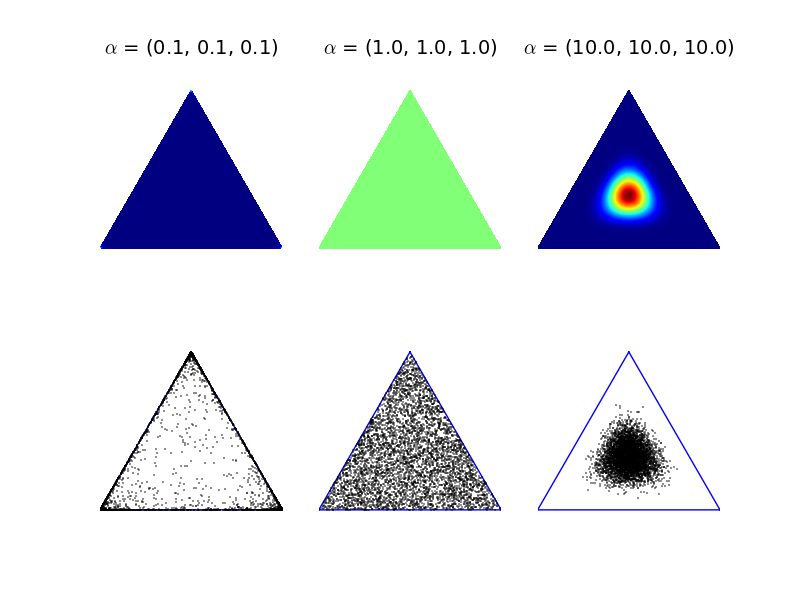

$$
\DeclareMathOperator{\N}{N}
\DeclareMathOperator{\Gam}{Gamma}
\DeclareMathOperator{\Wish}{Wishart}
\DeclareMathOperator{\tr}{tr}
\DeclareMathOperator{\Po}{Poisson}
\DeclareMathOperator{\Prob}{P}
$$

[Return to main Index](https://github.com/mauriciogtec/statsmodelling2)

```{r setup, include=FALSE}
knitr::opts_chunk$set(message = FALSE, warning = FALSE)
```


# Section 5: Mixture models

## Mixture Models

So far, we've assumed that our data are conditionally exchangeable given their covariates. In other words, for every unique set of covariates there exists a set of parameters, conditioned on which, the data with those covariates are i.i.d. We used various distributions over functions to learn a distribution over these parameters, for all covariate settings.

A common setting was when our data was normally distributed, with mean $\beta^Tx_i$ and variance $\sigma^2$. If we did not have the covariate values $x_i$, our data would no longer be normally distributed.

### Exercise 1

*Download the dataset restaurants.csv. This contains profit information for restaurants, based on seating capacity and whether they are open for dinner. Run a Bayesian regression of Profit vs SeatingCapacity and a dummy for DinnerService (you can reuse code from 2.12) (I'd suggest whitening Profit, it will make later prior specification easier). Do the residuals look normal? (e.g.\ plot histograms, qq plots). Now, let's just look at the raw Profit data: Does it look normal?*


*Solution*. First we read the data.

```{r}
library(tidyverse)
library(rstan)
```

```{r}
resto <- read_csv("./restaurants.csv")[ ,-1]
head(resto)
```

```{r}
dim(resto)
```

We'll use stan for our Bayesian linear regression.

```{stan, eval=FALSE}
// Stan model 1 for problem 1
data {
  // meta
  int<lower=1> N; // nobs
  // data
  vector[N] x; // feature
  vector[N] y; // response
  // prior
  real<lower=0> a0; // omega ~ Gamma(a0, shape = b0) !
  real<lower=0> b0;
  real mu0; // beta ~ N(mu0, (kappa0*omega)^{-1})
  real<lower=0> kappa0; 
}
parameters {
  real alpha; // intercept
  real beta; // lin coefs
  real<lower=0> omega; // precision
}
transformed parameters {
  real<lower=0> sigma; // standard dev
  vector[N] yhat; // linpred
  sigma = pow(omega, -0.5);
  yhat = alpha + x * beta;
}
model {
  // prior
  omega ~ gamma(a0, b0);
  beta ~ normal(mu0, sigma / kappa0);
  // likelihood
  y ~ normal(yhat, sigma);
}
generated quantities {
  vector[N] residuals;
  residuals = y - yhat;
}
```

```{r}
stan1 <- stan_model(file = "./stan1.stan")
```


```{r}
resto <- resto %>% 
  mutate(SeatingCapacity = as.numeric(SeatingCapacity)) %>% 
  mutate(profit_scaled = as.numeric(scale(Profit, scale = TRUE, center = FALSE)))
x <- resto %>% 
  pull(SeatingCapacity) 
y <- resto %>% 
  pull(profit_scaled)
```

```{r}
standat <- list(
  N = nrow(resto),
  x = x,
  y = y,
  a0 = 1.,
  b0 = 0.01,
  mu0 = 0.,
  kappa0 = 1.)
```

```{r}
fit1 <- sampling(
  stan1, 
  data = standat,
  iter = 500,
  chains = 2,
  cores = 2)
```

```{r}
summary(fit1)$summary %>% 
  as.data.frame() %>% 
  head(4)
```

```{r}
residuals <- rstan::extract(fit1, "residuals")$residuals
```

```{r}
all_residuals <- as.numeric(residuals)
hist(all_residuals, breaks = 50)
```

That's it! We see a bimodal shape on the residuals. Let's see more evidence.

```{r}
qqnorm(all_residuals, col = "gray", border = "white")
```

Again, not normal! 

[Back to Index](#TOC)

----

Let's assume we're in the situation where we don't know any of these covariate values. For now, let's ignore the continuous-valued covariate (SeatingCapacity), and try to infer the categorical covariate. Let's say we know that half our restaurants are open for dinner. We could assume that each restaurant is associated with a \textit{latent} indicator variable $Z_i$, that assigns them to one of two groups, so that

$$Z_i \sim \mbox{Bernoulli}(\pi)$$

As in the regression setting, conditioned on the latent variable, we will assume that the observed profits are i.i.d.\ normal. Again, as in the basic regression setting, we will assume the variances of the two normals are the same, but the means are different, i.e.

$$X_i|Z_i=z \sim \mbox{Normal}(\mu_{z}, \sigma^2).$$

If we marginalize over these binary indicators, our observations are assumed to be distributed according to a mixture of two Gaussians:

$$X_i \sim 0.5N(\mu_1,\sigma_1^2) + 0.5(\mu_2,\sigma_2^2)$$

We can then look at the posterior distribution over each indicator variable, conditioned on the class probabilities and parameters:

$$\begin{aligned}\Prob(Z_i = z|X_i, \pi, \mu_1,\sigma^2) \propto & \Prob(Z_i=z|\pi)p(X_i|\mu_z,\sigma^2)\\
  \mbox{so, }\qquad \Prob(Z_i=1|X_i, \pi, \mu_1,\sigma^2) \propto & \pi p(X_i|\mu_1,\sigma^2)\\
  \Prob(Z_i=0|X_i, \pi, \mu_1,\sigma^2) \propto & \Prob(Z_i=0|\pi)p(X_0|\mu_z,\sigma^2)
\end{aligned}$$

Conditioned on the $Z_i$, we can update the means of the Gaussians using conjugacy.

Note that we are not guaranteed to find latent clusters that correspond to the covariate we were expecting! If there is a more parsimonious partitioning of the data, then the posterior will tend to favor that partitioning.

### Exercise 2

*Let's assume (as is the case if our latent variables correspond to the actual DinnerService covariate) that the class proportions are roughly equal, and fix $\pi=0.5$. Using the conditional distributions $P(Z_i|X_i,\pi,\mu_1,\mu_2,\sigma^2)$ and $p(\mu_k|\{X_i:Z_i=k\}, \theta)$, where $\theta$ are appropriate (shared) prior parameters for $\mu_k$, implement a Gibbs sampler that samples the means and the latent indicator variables. I'd suggest using the parameters of the initial regression to pick your hyperparameters. Compare the clustering obtained with the ``true'' clustering due to the DinnerService variable.*

*Solution*. In this problem we want to estimate the density of Profits, which shows a slightly multimodal behaviour.

```{r}
hist(y, breaks = 40, col = "gray", border = "white")
```


The Gibbs sampler is very easy in this case because the weights are fixed. We only need to add the sampling step.

```{r}
gibbs2 <- function(nsim, y, prior) {
  # meta
  n <- length(y)
  
  # parameters
  mu <- matrix(0, nsim + 1, 2)
  omega <- numeric(nsim + 1)
  sigma <- numeric(nsim + 1)
  latent <- matrix(0, nsim + 1, n)
  
  # initialise
  omega[1] <- prior$a0 / prior$b0 # beta is rate here!
  sigma[1] <- 1 / sqrt(omega[1]) # std.dev
  mu[1, ] <- prior$mu0 # sensible values for mu
  for (i in 1:n) {
    wts <- 0.5 * map_dbl(mu[1, ], ~ dnorm(y[i], ., sigma[1]))
    latent[1, i] <- sample(2, 1, prob = wts / sum(wts)) # allocate ever individual
  }
  
  # constant quantities
  an <- prior$a0 + n/2 + 1 / 2
  
  # sampler
  for (k in 1:nsim) {
    # counts and means per component
    nj <- map_int(1:2, ~ sum(latent[k, ] == .))
    meanj <- map_dbl(1:2, ~ ifelse(nj[.] > 0, mean(y[latent[k, ] == .]), 0))
    # posterior parameters
    kappanj <- nj  + prior$kappa0 
    munj <- (nj * meanj + prior$kappa0 * prior$mu0) / kappanj
    bn <- prior$b0 + 0.5*sum((y - meanj[latent[k, ]])^2) +
      0.5*sum(prior$kappa0 * nj / kappanj * (meanj - prior$mu0)^2)
  
    # sample gamma  
    omega[k + 1] <- rgamma(1, an, bn)
    sigma[k + 1] <-  1 / sqrt(omega[k + 1])
    
    # sample the means
    mu[k + 1, ] <-  map_dbl(1:2, ~
      rnorm(1, munj[.], sigma[k + 1] / sqrt(kappanj[.])))
    # allocate again
    for (i in 1:n) {
      wts <- 0.5 * map_dbl(mu[k + 1, ], ~ dnorm(y[i], ., sigma[k + 1]))
      latent[k + 1, i] <- sample(2, 1, prob = wts / sum(wts))
    }
  }
  
  list(mu = mu[-1, ], omega = omega[-1], 
       sigma = sigma[-1], latent = latent[-1, ])
}
```

```{r}
nsim <- 100
prior <- list(mu0 = c(0.3, 1.2), a0 = 1, b0 = .01, kappa0 = 1.)
sim2 <- gibbs2(nsim, y, prior)
```

```{r}
{
grid_length <- 100
gridy <- seq(0.4, 1.6, length.out = grid_length)
hist(y[resto$DinnerService == 0], breaks= 20, prob = TRUE, 
  col = alpha("blue", 0.1), border = "white", xlim = c(0.3, 1.7), xlab = "Price",
  main = "Mixture density estimation")
hist(y[resto$DinnerService == 1], breaks= 20, prob = TRUE, add = TRUE,
  col = alpha("red", 0.1), border = "white")
hist(y, breaks= 40, prob = TRUE, add = TRUE,
  col = alpha("black", 0.1))
mean_dens <- numeric(grid_length)
for (k in 1:nsim) {
  dens <- 0.5 * dnorm(gridy, sim2$mu[k, 1], sim2$sigma[k]) +
    0.5 * dnorm(gridy, sim2$mu[k, 2], sim2$sigma[k])
  mean_dens <- mean_dens + dens / nsim
  lines(gridy, dens, col = alpha("black", 0.03), lw = 3)
}
lines(gridy, mean_dens, col = alpha("black", 0.8), lw = 2)
lines(density(y), col = "magenta")
legend("topright", c("price[service=0]", "price[service=1]", "price", "posterior density", "kde estimate"),
  pch = c(15, 15, 15, NA, NA), lt = c(NA, NA, NA, 1, 1, 1),
  col = c(alpha("blue", 0.4), alpha("red", 0.4), alpha("gray", 0.5), "black", "magenta"))
}
```

---


OK, let's now assume we don't know $\pi$, and that the two classes have different values of $\sigma^2$. Let's put a Beta$(\alpha,\beta)$ prior on $\pi$, since it is conjugate to the Bernoulli distribution. 


### Exercise 3

*Let's assume we want to integrate out $\pi$. What is the conditional distribution $P(z_i|z_{\neg i}, X_i,\mu_1,\mu_2,\sigma_1,\sigma_2,\alpha,\beta)$, where $Z_{\neg i}$ means all the values of $z$ except $z_i$?*

*Solution*. Write $\theta = (\alpha,\beta)$, $\mu=(\mu_1,\mu_2)$. Assume aprior
$$
\pi \sim \mathrm{Beta}(\nu_1,\nu_2)
$$
First we note that
$$
p(z_i\mid z_{\neg i}, x, \mu,\sigma^2,\theta) \propto N(x_i \mid \mu_{z_i},\sigma^2)p(z_i\mid z_{\neg i},\mu,\sigma^2,\theta)
$$
For the second term will do the following
$$
\begin{aligned}
p(z_i = 1\mid z_{\neg i},\mu,\sigma^2,\theta) & = 
\int p(Z_i = 1\mid \pi, z_{\neg i},\mu,\sigma^2,\theta)p(\pi\mid z_{\neg i},\mu, \sigma^2, \theta) d\pi \\
& = \int \pi p(\pi\mid z_{\neg i},\mu, \sigma^2, \theta) d\pi \\
& \propto \int \pi p(z_{\neg i} \mid \pi ,\mu, \sigma^2, \theta) p(\pi)d\pi \\
& \propto \int \pi \mathrm{Beta}(\pi \mid n_{1,\neg i} + \nu_1, n_{2,\neg i} +\nu_2)d\pi \\
& \propto E \left[ \mathrm{Beta}(n_{1,\neg i} + \nu_1, n_{2,\neg i} +\nu_2) \right] \\
& = \frac{n_{1,\neg i} + \nu_1}{n - 1+ \nu_1 + \nu_2}.
\end{aligned}
$$
where $n_{k,\neg i} = \sum_{j \neq i}1(Z_j=k)$ for $k=1,2$. Note that $n = n_{1,\neg i} + n_{2,\neg i} + 1$ is the size  $X$. Similarly,
$$
p(z_i = 2\mid z_{\neg i},\mu,\sigma^2,\theta) = \frac{n_{2,\neg i} + \nu_2}{n - 1+ \nu_1 + \nu_2}.
$$
We can write this succintly as
$$
p(z_i \mid z_{\neg i},\mu,\sigma^2,\theta) = \frac{n_{z_i,\neg i} + \nu_{z_i}}{n - 1+ \nu_1 + \nu_2}.
$$
So as a conclusion we have
$$
p(z_i = k\mid z_{\neg i},x_i, \mu,\sigma^2,\theta) \propto N(x_i \mid \mu_{k},\sigma^2)\frac{n_{k,\neg i} + \nu_{k}}{n - 1+ \nu_1 + \nu_2} \quad \text{ for } \quad k=1,2
$$

[Back to Index](#TOC)

----


### Exercise 4

*How about if we want to integrate out all of the continuous variables? What is the conditional distribution $P(Z_i|Z_{\neg i}, X, \theta)$, where $\theta$ is the set of all hyperparameters?*

*Solution*. So far I have been working with a single parameter $\sigma$ for all clusters. The math will be a little simpler if we allow a different $\sigma_j$ for each cluster. It's not that harder in the other case, but it's also an opportunity for extending the model. To simplify denote the parameters as
$$
\eta = (\eta_1, ..., \eta_K) = ((\mu_1,\sigma^2_1), ...., (\mu_K,\sigma_K^2))
$$
with conugate independent priors
$$
\mu_j \sim N(\mu_{0,j}, \sigma_j^2 / \kappa_{0}) \quad \sigma_j^2 \sim \text{InvGamma}(a_0, b_0),
$$
 For the mixture model, there are weights $w_j$ and latent variables $z_i$ 
such that
$$
p(x_i, z_i = j \mid w, \eta, \theta) = w_j N(x_i \mid \eta_j).
$$
with priors
$$
p(z_i = j \mid \pi) = w_j \quad \text{and} \quad \pi \sim \mathrm{Dirichlet}\left(\nu_1, ..., \nu_K\right).
$$
The hyperparameters are $\theta = (\kappa_0, a_0, b_0, \mu_0, \nu)$. For notational hygiene, I'll treat them as constants and not include them in the probability notations.

Finally, as a convenient notation, denote 
$$
n^{\neg i}_j:=\sum_{l=1, l \neq i}^n 1(z_l = j)
$$ 
as the total counf of latent allocation to cluster $j$ excluding observation $i$. Evidently, $\sum_j  n^{\neg i}_j = n - 1$ where $n$ is the total number of observations. In a similar spirit, we'll denote 
$$
\bar{x}^{\neg i}_{j}:= \frac{1}{n^{\neg i}_j} \sum_{l=1, l \neq i}^n x_i 1(z_l = j)
$$ 
the mean of the observed data for all the points excluding $x_i$.

Recall that as a result from the previous exercise we have that
$$
p(z_i = j \mid z_{\neg i},\eta) = \frac{\nu_j + n^{\neg i}_j}{\sum_k(\nu_k + n^{\neg i}_k)}.
$$
and therefore
$$
p(z_i = j \mid x_i, z_{\neg i},\eta) \propto N(x_i \mid \eta_j) \frac{\nu_j + n^{\neg i}_j}{\sum_k(\nu_k + n^{\neg i}_k)}.
$$

We now derive the expression required for the collapsed Gibbs sampler. Be mindful that $x$ denote the entire data, $x_i$ the i-th observation, and $x_{\neg i}$ the data removing the i-th observation. Also, we are being careful not to use the proportionality sign if the constant can't be taken outside the integral.

An application of the lat of total probability followed by Bayes' theorem on the second term inside the integral (separating $x_i$ from $x$) yields
$$
\begin{aligned}
p(z_i  \mid z_{\neg i}, x) &= \int p(z_i \mid z_{\neg i}, x, \eta) p(\eta \mid z_{\neg i}, x) d\eta \\
& \propto \int p(z_i \mid z_{\neg i},x , \eta) p(x_i \mid z_i, x_{\neg i}, \eta)p(\eta\mid z_{\neg i}, x_{\neg i}) d\eta.
\end{aligned}
$$
We now have the posterior for all the data excluding observation $i$ appearing as the right-term of the integrand. For the other two term we observe the identity (another application of Bayes' theorem separating $x_i$ from $x$ on the left-term)
$$
\begin{aligned}
p(z_i \mid z_{\neg i}, x , \eta) p(x_i \mid \eta, z_i, x_{\neg i}) & = \frac{p(x_i \mid z, x_{\neg i}, \eta)p(z_i \mid z_{\neg i}, x_{\neg i}, \eta)}{p(x_i \mid z_i, x_{\neg i}, \eta)}p(x_i \mid z_i, x_{\neg i}, \eta) \\
& = p(x_i \mid z, x_{\neg i}, \eta)p(z_i \mid z_{\neg i}, x_{\neg i}, \eta) \\
& = p(x_i \mid z_i, \eta)p(z_i \mid z_{\neg i}, \eta) \\
& = N(x_i \mid \eta_{z_i})\frac{\nu_{z_i} + n^{\neg i}_{z_i}}{\sum_k(\nu_k + n^{\neg i}_k)}
\end{aligned}
$$
where the third equality holds because the $x_i$ are independent of the $x_{\neg i}$ and $z_{\neg i}$ given $\eta$; and similarly, $z_i$ is independent of $x_{\neg i}$ given $z_{\neg i}$ and $\eta$. Now plugging this back into the integral we get
$$
p(z_i  \mid z_{\neg i}, x) \propto (\nu_j + n^{\neg i}_j)\int N(x_i \mid \eta_{z_i}) p(\eta \mid z_{\neg i}, x_{\neg i}) d\eta
$$
Finally, our particular choice of priors makes the posterior of $\eta$ to split as 
$$
 p(\eta \mid z_{\neg i}, x_{\neg i}) = \prod_{j=1}^Kp(\eta_j \mid z_{\neg i}, x_{\neg i}).
$$
So we have
$$
(\nu_{} + n^{\neg i}_{z_i})\int N(x_i \mid \eta_{z_i}) p(\eta \mid z_{\neg i}, x_{\neg i}) d\eta = (\nu_{z_i} + n^{\neg i}_{z_i})\int N(x_i \mid \eta_{z_i}) p(\eta_{z_i} \mid z_{\neg i}, x_{\neg i}) d\eta_{z_i},
$$
and this integral is a piece of cake, since we have computed this integral many times: it is the posterior predictive of a normal distribution, which we know it's a t-distribution.

So putting all together we arrive to
$$
p(z_i  = j\mid z_{\neg i}, x) \propto (\nu_j + n^{\neg i}_j) \,\mathrm{tStudent}\left(x_i \mid \mu^{\neg i}_{n, j}, \left(1 + 1/\kappa^{-j}_{n,j}\right) b_{n, j}^{\neg i} / a^{\neg i}_{n, j}, 2a^{\neg i}_{n, j} \right)
$$

* $\kappa^{\neg i}_{n, j} = \kappa_0 + n^{\neg i}_j$
* $\mu^{\neg i}_{n, j} = \frac{n^{\neg i}_{j}}{\kappa^{\neg i}_{n, j}}\bar{x}^{\neg i}_{j} + \frac{\kappa_0}{\kappa^{\neg i}_{n, j}}\mu_{0,j}$
* $a^{\neg i}_{n, j} = a_0 + n^{\neg i}_j / 2$
* $b^{\neg i}_{n, j} = b_0 + \frac{1}{2}\sum_{z_k = j, k\neq i}(x_i - \bar{x}^{\neg i}_{j} )^2 + \frac{n^{\neg i}_{j} \kappa_0 }{\kappa^{\neg i}_{n, j}}(\bar{x}^{\neg i}_{j}  - \mu_{0,j})^2$.

The problem with these expressions is that they are different for each $i$, and having to recompute everything for each iteration is not efficient. It'd be better if we can express this in terms of the sufficient statistics of the complete data. Denote for convenience denote $I_{ij}= 1(z_i = j)$, and define the sufficient statistics of the complete data
$$
n_j = \sum_i I_{ij}, \quad s_j = \sum_i x_i I_{ij}, \quad ss_j = \sum_i x_i^2 I_{ij}
$$

* $n^{\neg i}_{n, j} = n_j - I_{ij}$
* $\kappa^{\neg i}_{n, j} = \kappa_0 + n^{\neg i}_j$
* $\bar{x}^{\neg i}_{n, j} =\frac{s_j - x_i I_{ij}}{n^{\neg i}_{n, j}}$
* $\mu^{\neg i}_{n, j} = \frac{n^{\neg i}_{n, j}}{\kappa^{\neg i}_{n, j}}\bar{x}^{\neg i}_{n, j} + \frac{\kappa_0}{\kappa^{\neg i}_{n, j}}\mu_{0,j}$
* $a^{\neg i}_{n, j} = a_0 + n^{\neg i}_j / 2$
* $\zeta^{\neg i}_{n, j} = (ss_j - x_i^2 I_{ij}) - n^{\neg i}_{n, j}(\bar{x}^{\neg i}_{n, j})^2$
* $b^{\neg i}_{n, j} = b_0 + \frac{1}{2}\left(\zeta^{\neg i}_{n, j}  + \frac{\kappa_0 n^{\neg i}_{n, j}}{\kappa^{\neg i}_{n, j}}\left(\bar{x}^{\neg i}_{n, j} - \mu_{0,j}\right)^2\right)$

This should be useful to derive an efficient sampler.

[Back to Index](#TOC)

----

### Exercise 5

*Implement a Gibbs sampler for this new model where we learn the cluster proportions. You can either implement one of the variants in the previous two exercises, or the fully uncollapsed model where we sample $Z$, $\pi$, $\mu_1$, $\mu_2$, $\sigma^2_1$ and $\sigma^2_2$.*

*Solution*. I'll implement the sampler from Exercise 3 since it's just an adaptation from Exercise 2. All we need to do is to change the resampling scheme of the $z$ at the end of the inner loop according to the expression found at Exercise 3.

```{r}
gibbs5 <- function(nsim, y, prior) {
  # meta
  n <- length(y)
  
  # parameters
  mu <- matrix(0, nsim + 1, 2)
  omega <- numeric(nsim + 1)
  sigma <- numeric(nsim + 1)
  latent <- matrix(0, nsim + 1, n)
  # transformed parameter
  weights <- matrix(0, nsim + 1, 2)
  
  # initialise
  omega[1] <- prior$a0 / prior$b0 # beta is rate here!
  sigma[1] <- 1 / sqrt(omega[1]) # std.dev
  mu[1, ] <- prior$mu0 # sensible values for mu
  for (i in 1:n) { # smart starting value according to prior
    latent[1, i] <- sample(2, 1, prob = prior$nu / sum(prior$nu)) # allocate ever individual
  }
  nj <- map_int(1:2, ~ sum(latent[1, ] == .))
  weights[1, ] <- prior$nu / sum(prior$nu)
  
  # constant quantities
  an <- prior$a0 + n/2 + 1 / 2
  
  # sampler
  for (k in 1:nsim) {
    # counts and means per component
    meanj <- map_dbl(1:2, ~ ifelse(nj[.] > 0, mean(y[latent[k, ] == .]), 0))
    # posterior parameters
    kappanj <- nj  + prior$kappa0 
    munj <- (nj * meanj + prior$kappa0 * prior$mu0) / kappanj
    bn <- prior$b0 + 0.5*sum((y - meanj[latent[k, ]])^2) +
      0.5*sum(prior$kappa0 * nj / kappanj * (meanj - prior$mu0)^2)
  
    # sample gamma  
    omega[k + 1] <- rgamma(1, an, bn)
    sigma[k + 1] <-  1 / sqrt(omega[k + 1])
    
    # sample the means
    mu[k + 1, ] <-  map_dbl(1:2, ~
      rnorm(1, munj[.], sigma[k + 1] / sqrt(kappanj[.])))
    
    # allocate again
    latent[k + 1, i] <- latent[k, i] # make a copy
    for (i in 1:n) { 
      cnts <- nj + prior$nu - as.integer(latent[k + 1, i] == 1:2)
      wts <- cnts * map_dbl(mu[k + 1, ], ~ dnorm(y[i], ., sigma[k + 1]))
      latent[k+ 1, i] <- sample(2, 1, prob = wts / sum(wts)) # allocate ever individual
    }
    nj <- map_int(1:2, ~ sum(latent[k + 1, ] == .))
    weights[k + 1, ] <- (nj + prior$nu) / sum(nj + prior$nu)
  }
  
  list(mu = mu[-1, ], omega = omega[-1], 
       sigma = sigma[-1], latent = latent[-1, ], weights = weights[-1, ])
}
```

```{r}
nsim <- 500
prior <- list(mu0 = c(0.3, 1.2), a0 = 1, b0 = .01, kappa0 = 1., nu = c(1, 1))
sim5 <- gibbs5(nsim, y, prior)
```

We can graph the result as in Exercise 2 to see the results.

```{r}
{
warmup <- 250
grid_length <- 100
gridy <- seq(0.4, 1.6, length.out = grid_length)
hist(y[resto$DinnerService == 0], breaks= 20, prob = TRUE, 
  col = alpha("blue", 0.1), border = "white", xlim = c(0.3, 1.7), xlab = "Price",
  main = "Problem 5: Collapsed Sampler from Exercise 3")
hist(y[resto$DinnerService == 1], breaks= 20, prob = TRUE, add = TRUE,
  col = alpha("red", 0.1), border = "white")
hist(y, breaks= 40, prob = TRUE, add = TRUE,
  col = alpha("black", 0.1))
mean_dens <- numeric(grid_length)
for (k in (warmup + 1):nsim) {
  dens <- sim5$weights[k, 1] * dnorm(gridy, sim5$mu[k, 1], sim5$sigma[k]) +
   sim5$weights[k, 2] * dnorm(gridy, sim5$mu[k, 2], sim5$sigma[k])
  mean_dens <- mean_dens + dens / (nsim - warmup)
  lines(gridy, dens, col = alpha("black", 0.02), lw = 3)
}
lines(gridy, mean_dens, col = alpha("black", 0.8), lw = 2)
lines(density(y), col = "magenta")
legend("topright", c("price[service=0]", "price[service=1]", "price", "posterior density", "kde estimate"),
  pch = c(15, 15, 15, NA, NA), lt = c(NA, NA, NA, 1, 1, 1),
  col = c(alpha("blue", 0.4), alpha("red", 0.4), alpha("gray", 0.5), "black", "magenta"))
}
```


[Back to Index](#TOC)


----


Let's now consider the case where we have more than two classes. Here, we need to replace our Bernoulli distribution with a multinomial parametrized by some probability vector $\pi$, so that:

$$P(Z_i = k) = \pi_k$$

  Much as the multinomial is the multivariate generalization of the binomial distribution, the Dirichlet($\alpha_1,\dots,\alpha_K$) distribution, which has pdf
  $$\frac{\Gamma(\sum_k \alpha_k)}{\prod_k \Gamma(\alpha_k)} \prod_{k=1}^K \pi_k^{\alpha_k},$$
  is the multivariate generalization of the beta distribution. Here, $\alpha$ is a $D$-dimensional vector where $\alpha_k>0$ and $\sum_k\alpha_k\geq 1$. The expectation of a Dirichlet distribution is given by the normalized parameter vector, $E[\pi] = \frac{(\alpha_1,\dots,\alpha_K)}{\sum_k\alpha_k}$. The absolute magnitude of the parameter acts like an inverse variance: the smaller its values, the further a given sample is from the expected value. Figure below shows the pdf of three Dirichlet distributions represented on the 3-simplex, with samples from those distributions
  



### Exercise 6

*Show that the Dirichlet is conjugate to the multinomial, and derive the posterior predictive distribution
  $$P(Z_{n+1}|Z_{1:n}) = \int_{\mathcal{M}} P(Z_{n+1}|\pi)p(\pi \mid Z_{1:n}) d\pi$$
  You may find it helpful to note that, if $\pi\sim \mbox{Dirichlet}(\alpha_1,\dots,\alpha_K)$, then $E[\pi] = \frac{(\alpha_1,\dots,\alpha_K)}{\sum_k\alpha_k}$.*

*Solution*. The key is to write the distribution the multinomial distribution as
$$
\mathrm{Multinomial}(Z\mid \pi_1, ..., \pi_K) \propto \pi_1^{1(Z=1)} \cdots \pi_K^{1(Z = K)}
$$
Then
$$
\begin{aligned}
p(\pi \mid Z) &\propto p(\pi)\prod_ip(Z_i \mid \pi) \\
& \propto \pi_1^{\alpha_1 - 1} \cdots \pi_K^{\alpha_K - 1} \prod_i \pi_1^{1(Z_i=1)}\cdots \pi_K^{1(Z_i=K)} \\
& \propto \pi_1^{\alpha_1 -1 + N_1} \cdots \pi_K^{\alpha_K -1 + N_k} \\
& \propto \mathrm{Dirichlet}\left(\pi \mid \alpha_1 + N_1 -1, ...,  N_K + \alpha_K -1\right) 
\end{aligned}
$$
where $N_j = \sum_i 1(Z_i = j)$. This also helps us to interpret the initial hyperparameters $\alpha_j$ of the Dirichlet Distribution as pseudo-counts.

The key for the following is to observe the following simple identity
$$
P(Z \mid \pi) = \pi
$$
Then the posterior predictive is
$$
\begin{aligned}
P(Z_{n+1} \mid Z_{1:n}) & = \int_{\mathcal{M}}  P(Z_{n+1} \mid \pi)p(\pi \mid Z_{1:n}) d\pi \\
& \propto  \int_{\mathcal{M}}  \pi p(\pi \mid Z_{1:n})  d\pi \\
& =  E\left[\mathrm{Dirichlet}\left(\pi \mid \alpha_1 + N_1 -1, ...,  N_K + \alpha_K -1\right) \right] \\
& \propto  \mathrm{Multinomial}\left(\left(\frac{\alpha_j + N_j}{\sum_j(\alpha_j + N_j)}\right)_{j=1}^K\right). \\
\end{aligned}
$$


[Back to Index](#TOC)


----


### Exercise 7

*Modify your previous Gibbs sampler to allow multiple classes, and two-dimensional data. Generate some data according to a Dirichlet mixture of 5 Gaussians in $\mathbb{R}^2$, and test your code on it.*

**PART 1: Multiple Classes but One dimensional**

**Strategy A.1: A collapsed sampler**

Here's the modified Gibbs sampler. Tiny modifications and using a Dirichlet. As a nice bonus I'm adding a process bar.

```{r}
library(tidyverse)
library(progress)
```


```{r}
gibbs7 <- function(nsim, y, prior) {
  # meta
  n <- length(y)
  K <- length(prior$mu0)
  
  # parameters
  mu <- matrix(0, nsim + 1, K)
  omega <- numeric(nsim + 1)
  sigma <- numeric(nsim + 1)
  latent <- matrix(0, nsim + 1, n)
  # transformed parameter
  weights <- matrix(0, nsim + 1, K)
  
  # initialise
  omega[1] <- prior$a0 / prior$b0 # beta is rate here!
  sigma[1] <- 1 / sqrt(omega[1]) # std.dev
  mu[1, ] <- prior$mu0 # sensible values for mu
  for (i in 1:n) { # smart starting value according to prior
    latent[1, i] <- sample(K, 1, prob = prior$nu / sum(prior$nu)) # allocate ever individual
  }
  nj <- map_int(1:K, ~ sum(latent[1, ] == .))
  weights[1, ] <- prior$nu / sum(prior$nu)
  
  # constant quantities
  an <- prior$a0 + (n - 1)/2 + K / 2
  
  # sampler
  # pb <- progress_bar$new(total = nsim)
  for (k in 1:nsim) {
    # counts and means per component
    meanj <- map_dbl(1:K, ~ ifelse(nj[.] > 0, mean(y[latent[k, ] == .]), 0))
    # posterior parameters
    kappanj <- nj  + prior$kappa0 
    munj <- (nj * meanj + prior$kappa0 * prior$mu0) / kappanj
    bn <- prior$b0 + 0.5*sum((y - meanj[latent[k, ]])^2) +
      0.5*sum(prior$kappa0 * nj / kappanj * (meanj - prior$mu0)^2)
  
    # sample gamma  
    omega[k + 1] <- rgamma(1, an, bn)
    sigma[k + 1] <-  1 / sqrt(omega[k + 1])
    
    # sample the means
    mu[k + 1, ] <-  map_dbl(1:K, ~
      rnorm(1, munj[.], sigma[k + 1] / sqrt(kappanj[.])))
    
    # allocate again
    latent[k + 1, i] <- latent[k, i] # make a copy
    for (i in 1:n) {
      cnts <- nj + prior$nu - as.integer(latent[k + 1, i] == 1:K)
      wts <- cnts * map_dbl(mu[k + 1, ], ~ dnorm(y[i], ., sigma[k + 1]))
      latent[k+ 1, i] <- sample(K, 1, prob = wts / sum(wts)) # allocate ever individual
    }
    nj <- map_int(1:K, ~ sum(latent[k + 1, ] == .))
    weights[k + 1, ] <- (nj + prior$nu) / sum(nj + prior$nu)
    # pb$tick()
  }
  
  list(mu = mu[-1, ], omega = omega[-1], 
       sigma = sigma[-1], latent = latent[-1, ], weights = weights[-1, ])
}
```


First let's generate data

```{r}
K <- 5
n <- 1000
w_true <- c(0.3, 0.1, 0.2, 0.3, 0.1)
mu_true <- seq(-2.5, 2.5, length.out = 5)
sigma_true <- 0.35
simdata <- map_dbl(1:n, ~{j = sample(K, 1, prob = w_true); rnorm(1, mu_true[j], sigma_true)})
```

And run the sampler
```{r}
nsim <- 1000
set.seed(110104)
prior <- list(mu0 = rnorm(K), a0 = 10, b0 = .01, kappa0 = .01, nu = rep(1, K))
sim7 <- gibbs7(nsim, simdata, prior)
```

We can graph the results

```{r}
{
warmup <- 500
grid_length <- 100
gridy <- seq(-4.5, 4.5, length.out = grid_length)
hist(simdata, breaks = 35, prob = TRUE, xlim = c(-4.5, 4.5),
  col = alpha("blue", 0.15), border = "white", xlab = "simulated data",
  main = "Problem 7: Normal  K=5 clusters (simulated data)")
mean_dens <- numeric(grid_length)
for (k in (warmup + 1):nsim) {
  dens <- numeric(grid_length)
  for (i in 1:grid_length) {
    dens[i] <- sum(sim7$weights[k, ] * map_dbl(1:K, ~dnorm(gridy[i], sim7$mu[k, .], sim7$sigma[k])))
  }
  mean_dens <- mean_dens + dens / (nsim - warmup)
  lines(gridy, dens, col = alpha("black", 0.005), lw = 3)
}
lines(gridy, mean_dens, col = alpha("black", 0.8), lw = 2)
true_dens <- numeric(grid_length)
for (i in 1:grid_length) {
  true_dens[i] <- sum(w_true * map_dbl(1:K, ~dnorm(gridy[i], mu_true[.], sigma_true)))
}
# lines(density(simdata, bw = sigma_true / 2), col = "magenta")
lines(gridy, true_dens, col = "magenta", lt = 2, lw = 2)
lines(density(simdata, bw = sigma_true / 2), col = "darkgreen", lt = 3, lw = 2)
legend("topright", c("histogram", "posterior mean", "true density", "kde"),
  pch = c(15, NA, NA, NA), lt = c(NA,  1, 2, 3), lw = c(NA, 1, 2, 2),
  col = c(alpha("blue", 0.4), "black", "magenta", "darkgreen"))
}
```

**Strategy A.2: A more collapsed sampler**

Let's now program the sampler from Exercise 5 that further collapses the parameters.


```{r}
gibbs7b <- function(nsim, y, prior) {
  # meta
  n <- length(y)
  K <- length(prior$mu0)
  
  # latent variables & sufficient statistics
  latent <- matrix(0, nsim + 1, n)
  nj <- matrix(0, nsim + 1, K)
  sj <- matrix(0, nsim + 1, K)
  ssj <- matrix(0, nsim + 1, K)
  
  # initialise
  latent[1, ] <- sample(1:K, size = n, replace = TRUE, prob = prior$nu)
  nj[1, ] <- map_int(1:K, ~ sum(latent[1, ] == .))
  sj[1, ] <- map_dbl(1:K, ~ sum(y[latent[1, ] == .]))
  ssj[1, ] <- map_dbl(1:K, ~ sum(((y[latent[1, ] == .]))^2))

  # sampler 
  for (k in 1:nsim) {
    # update latent variales
    for (i in 1:n) {
      # obtain posterior hyperparameters
      nj_negi <- nj[k, ] - as.integer(latent[k, i] == 1:K)
      ybarj_negi <- (sj[k, ]  - y[i] * as.integer(latent[k, i] == 1:K)) / pmax(nj_negi, 1) # careful with zeros
      kappaj_negi <- nj_negi + prior$kappa0
      muj_negi <- (nj_negi * ybarj_negi + prior$kappa0 * prior$mu0) / kappaj_negi
      aj_negi <- prior$a0 + 0.5 * nj_negi
      zetaj_negi <-  ssj[k, ] - y[i]^2 * as.integer(latent[k, i] == 1:K) -
        nj_negi * (ybarj_negi)^2
      bj_negi <- prior$b0 + 0.5*zetaj_negi +
        0.5 * (prior$kappa0 * nj_negi * (ybarj_negi - prior$mu0)^2 / kappaj_negi)
      sigmaj_negi <- sqrt((1 + 1/kappaj_negi) * bj_negi / aj_negi)
      df_negi <- 2 * aj_negi
      
      # resample individual
      wts <- (prior$nu + nj_negi) * dt((y[i] - muj_negi) / sigmaj_negi, df = df_negi) / sigmaj_negi
      latent[k + 1, i] <- sample(1:K, size = 1, prob = wts / sum(wts))
    }
     
    # update sufficient statistics
    nj[k + 1, ] <- map_int(1:K, ~ sum(latent[k + 1, ] == .))
    sj[k + 1, ] <- map_dbl(1:K, ~ sum(y[latent[k + 1, ] == .]))
    ssj[k + 1, ] <- map_dbl(1:K, ~ sum(((y[latent[k + 1, ] == .]))^2))    
  }
  
  list(latent = latent, nj = nj, sj = sj, ssj = ssj)
}
```


Run the sampler

```{r}
nsim <- 10000
set.seed(999)
prior <- list(mu0 = rnorm(K, 0, 6), a0 = 20, b0 = 0.01, kappa0 = .1, nu = rep(1, K))
sim7b <- gibbs7b(nsim, simdata, prior)
```

Graph the results (now it's trickier because we need predictive densities)

```{r}
{
warmup <- nsim %/% 2
grid_length <- 100
gridy <- seq(-4.5, 4.5, length.out = grid_length)
hist(simdata, breaks = 35, prob = TRUE, xlim = c(-4.5, 4.5),
  col = alpha("blue", 0.15), border = "white", xlab = "simulated data",
  main = "Problem 7 (extra):  K=5 per clusters variances cluster (simulated data)")
mean_dens <- numeric(grid_length)
for (k in (warmup + 1):nsim) {
  # Find predictive hyperparameters
  nj <- sim7b$nj[k, ]
  ybarj <-  sim7b$sj[k, ] / pmax(1, nj)
  kappaj <- nj + prior$kappa0
  muj <- (nj * ybarj + prior$kappa0 * prior$mu0) / kappaj
  aj <- prior$a0 + 0.5 * kappaj
  zetaj <-   sim7b$ssj[k, ] - nj * (ybarj)^2
  bj <- prior$b0 + 0.5 * zetaj + 0.5 * prior$kappa0 * nj * (ybarj - prior$mu0)^2 / kappaj
  sigmaj <- sqrt((1 + 1/kappaj) * bj / aj)
  df <- 2 * aj
  # Evaluate
  dens <- numeric(grid_length)
  for (i in 1:grid_length) {
    dens[i] <- sum((prior$nu + nj) * dt((gridy[i] - muj) / sigmaj, df = df) / sigmaj) / sum(nj) 
  }
  mean_dens <- mean_dens + dens / (nsim - warmup)
  lines(gridy, dens, col = alpha("black", 0.005), lw = 3)
}
lines(gridy, mean_dens, col = alpha("black", 0.8), lw = 2)
true_dens <- numeric(grid_length)
for (i in 1:grid_length) {
  true_dens[i] <- sum(w_true * map_dbl(1:K, ~dnorm(gridy[i], mu_true[.], sigma_true)))
}
# lines(density(simdata, bw = sigma_true / 2), col = "magenta")
lines(gridy, true_dens, col = "magenta", lt = 2, lw = 2)
lines(density(simdata, bw = sigma_true / 2), col = "darkgreen", lt = 3, lw = 2)
legend("topright", c("histogram", "posterior mean", "true density", "kde"),
  pch = c(15, NA, NA, NA), lt = c(NA,  1, 2, 3), lw = c(NA, 1, 2, 2),
  col = c(alpha("blue", 0.4), "black", "magenta", "darkgreen"))
}
```

**PART 2: Multiple Dimensions**

We'll now derive a sampler for $x\in \mathbb{R}^d$. I'll adapt the multiple-variance parameter version of the last collapsed sampler. The problem is that we'll need a multivariate t distribution. Probably the best way to manipulate the data now is with matrices, so that things keep working more less similarly. The mathematics are identical to what we did before, just adapting the to the multivariate version. Choice of priors
$$
\Lambda \sim W(\xi_0, \Omega_0^{-1}), \quad \mu_j \sim N(0, (\kappa_0 \Lambda)^{-1}), \quad 
$$
Posterior predictive
$$
p(z_i  = j\mid z_{\neg i}, x) \propto (\nu_j + n^{\neg i}_j) \,\mathrm{tStudent}\left(x_i \;\big\vert\; \mu^{\neg i}_{n, j}, \;  (\kappa^{\neg i}_{n, j}(\xi^{\neg i}_{n, j} - d + 1))^{-1}\Omega^{\neg i}_{n, j}, \; \xi^{\neg i}_{n, j} - d + 1\right).
$$

where

* $\kappa^{\neg i}_{n, j} = \kappa_0 + n^{\neg i}_j$
* $\mu^{\neg i}_{n, j} = \frac{n^{\neg i}_{j}}{\kappa^{\neg i}_{n, j}}\bar{x}^{\neg i}_{j} + \frac{\kappa_0}{\kappa^{\neg i}_{n, j}}\mu_{0,j}$
* $\xi^{\neg i}_{n, j} = \xi_0 + n^{\neg i}_j$
* $\Omega^{\neg i}_{n, j} = \Omega_0 + \sum_{k \neq i, z_k=j} (x_k - \bar{x}^{\neg i}_{j})(x_k - \bar{x}^{\neg i}_{j})' + \frac{\kappa_0n^{\neg i}_j}{\kappa^{\neg i}_{n, j}}(\bar{x}^{\neg i}_{j} - \mu_0)(\bar{x}^{\neg i}_{j}- \mu_0)'$.

In order to implement it efficiently we'll need sufficient statistics

$$
n_j = \sum_i I_{ij}, \quad s_j = \sum_i x_i I_{ij}, \quad SS_j = \sum_i x_ix_i'I_{ij}
$$

* $n^{\neg i}_{n, j} = n_j - I_{ij}$
* $\kappa^{\neg i}_{n, j} = \kappa_0 + n^{\neg i}_j$
* $\bar{x}^{\neg i}_{n, j} =\frac{s_j - x_i I_{ij}}{n^{\neg i}_{n, j}}$
* $\mu^{\neg i}_{n, j} = \frac{n^{\neg i}_{n, j}}{\kappa^{\neg i}_{n, j}}\bar{x}^{\neg i}_{n, j} + \frac{\kappa_0}{\kappa^{\neg i}_{n, j}}\mu_{0,j}$
* $\xi^{\neg i}_{n, j} = \xi + n^{\neg i}_j$
* $\zeta^{\neg i}_{n, j} = (SS_j - x_ix_i' I_{ij}) - n^{\neg i}_{n, j}(\bar{x}^{\neg i}_{n, j})(\bar{x}^{\neg i}_{n, j})'$
* $\Omega^{\neg i}_{n, j} = \Omega_0 + \zeta^{\neg i}_{n, j}  + \frac{\kappa_0 n^{\neg i}_{n, j}}{\kappa^{\neg i}_{n, j}}\left(\bar{x}^{\neg i}_{n, j} - \mu_{0,j}\right)^2$

This should be useful to derive an efficient sampler.

```{r}
library(tidyverse)
library(mvtnorm)
library(Matrix)
```

Let's start by simulate a bivariate version of the simulated data form before.

```{r}
K <- 3
d <- 2
n <- 300
w_true <- c(0.3, 0.1, 0.21)
mu_true <- matrix(c(-2, 2, 0, -2, 1.5, 0), ncol = 2, byrow = TRUE)
sigma2_true <- 0.35
simdata <- matrix(0, n, d)
simdata[1:100, ] <- rmvnorm(100, mu_true[1, ], diag(sigma2_true, d))
simdata[101:200, ] <- rmvnorm(100, mu_true[2, ], diag(sigma2_true, d))
simdata[201:300, ] <- rmvnorm(100, mu_true[3, ], diag(sigma2_true, d))
ground_truth <- c(rep(1, 100), rep(2, 100), rep(3, 100))
```

```{r}
plot(simdata, pch = 21, bg = ground_truth, main = "simulated bidimensional data")
```


```{r}
gibbs7c <- function(nsim, Y, prior, progress = FALSE) {
  # meta
  n <- nrow(Y)
  d <- ncol(Y)
  K <- length(prior$nu)
  
  # latent variables & sufficient statistics
  latent <- matrix(0, nsim + 1, n)
  nj <- matrix(0, nsim + 1, K)
  sj <- array(0, c(nsim + 1, K, d))
  SSj <- array(0, dim = c(nsim + 1, K, d, d))
  
  # initialise
  latent[1, ] <- sample(1:K, size = n, replace = TRUE, prob = prior$nu)
  for (j in 1:K) {
    nj[1, j] <- sum(latent[1, ] == j)  
    Yj <- Y[latent[1, ] == j, ]
    sj[1, j, ] <- apply(Yj, 2, sum)
    SSj[1, j, , ] <- crossprod(Yj)
  }
  

  # sampler 
  if(progress) pb <- progress::progress_bar$new(total = nsim)
  for (k in 1:nsim) {
    # update latent
    for (i in 1:n) {
      wts <- numeric(K)
      for (j in 1:K) { 
        # Adjust sufficient statistics if necessary
        nj_negi <- nj[k, j]
        sj_negi <- sj[k, j, ]
        SSj_negi <- SSj[k, j, , ]
        if (latent[k, i] == j) {
          nj_negi <- nj_negi - 1
          sj_negi <- sj_negi - Y[i, ]
          SSj_negi <- SSj_negi - tcrossprod(Y[i, ])
        } 
        
        # Find all hyperparameters
        ybarj_negi <- sj_negi / pmax(nj_negi, 1) 
        kappaj_negi <- nj_negi + prior$kappa0
        muj_negi <- (nj_negi * ybarj_negi + prior$kappa0 * prior$mu0[j, ]) / kappaj_negi
        xij_negi <- prior$xi0 + nj_negi
        Omegaj_negi <- prior$Omega0 + SSj_negi - nj_negi * tcrossprod(ybarj_negi) + 
          prior$kappa0 * nj_negi / kappaj_negi * tcrossprod(ybarj_negi - prior$mu0[j])
        Sigmaj_negi <- (1 + 1 / kappaj_negi) * Omegaj_negi / (xij_negi - d + 1) 
          
        # assign weight
        wts[j] <-  (prior$nu[j] + nj_negi) * pmin(dmvt(Y[i, ], muj_negi, Sigmaj_negi, xij_negi - d + 1, log = FALSE), 1)
        if (sum(wts) == 0) {
          wts <- rep(1, K)
        }
      }
      # wts <- wts / sum(wts)
      # wts <- pmax(wts, 1/n)
      wts <- wts + 1e-6
      latent[k + 1, i] <- sample(1:K, size = 1, prob = wts)
    }
  
    # update sufficient statistics
    for (j in 1:K) {
      nj[k + 1, j] <- sum(latent[k + 1, ] == j)  
      if (nj[k + 1, j] > 0) {
        Yj <- Y[latent[k + 1, ] == j, ]
        if (nj[k + 1, j] > 1) {
          sj[k + 1, j, ] <- apply(Yj, 2, sum)  
          SSj[k + 1, j, , ] <- crossprod(Yj)  
        } else {
          sj[k + 1, j, ] <- Yj
          SSj[k + 1, j, , ] <- matrix(0, d, d)
        }
      } else {
        sj[k + 1, j, ] <- rep(0, d)
        SSj[k + 1, j, , ] <- matrix(0, d, d)
      }
      
    }
    if(progress) pb$tick()
  }
  
  list(latent = latent, nj = nj, sj = sj, SSj = SSj)
}
```

Because this is already complex, we'll do a function evaluate the density of points that we'll recycle later.

```{r}
eval_density7c <- function(Y, sim, prior, warmup = 0) {
  nsim <- nrow(sim$latent)
  n <- nrow(Y)
  d <- ncol(Y)
  K <- length(prior$nu)
  
  dens <- numeric(n)
  for (k in (warmup + 1):nsim) {
    for (i in 1:n) {
      wts <- numeric(K)
      for (j in 1:K) { 
        # Adjust sufficient statistics if necessary
        nj <- sim$nj[k, j]
        sj <- sim$sj[k, j, ]
        SSj <- sim$SSj[k, j, , ]
        
        # Find all hyperparameters
        ybarj <- sj / pmax(nj, 1) 
        kappaj <- nj + prior$kappa0
        muj <- (nj * ybarj + prior$kappa0 * prior$mu0[j, ]) / kappaj
        xij <- prior$xi0 + nj
        Omegaj <- prior$Omega0 + SSj - nj * tcrossprod(ybarj) + 
          prior$kappa0 * nj / kappaj * tcrossprod(ybarj - prior$mu0[j])
        Sigmaj <- (1 + 1 / kappaj) * Omegaj / (xij - d + 1)
          
        # assign weight
        wts[j] <-  (prior$nu[j] + nj) * dmvt(Y[i, ], muj, Sigmaj, xij - d + 1, log = FALSE)
      }
      dens[i] <- dens[i] +  sum(wts) / sum(prior$nu + sim7c$nj[k, ]) / (nsim - warmup)
    }
  }
  dens
}
```

Definition of prior
```{r}
K <- 3
d <- 2
prior <- list(mu0 = matrix(rnorm(K*d, 0, 1), ncol = d), xi0 = 1, Omega0 = diag(d), kappa0 = 1, nu = rep(1, K))
```


Running the sampler
```{r}
nsim <- 100
set.seed(999999)
sim7c <- gibbs7c(nsim, simdata, prior)
```

```{r}
resol <- 10
x = seq(-3, 3, length.out = resol)
y = seq(-3, 3, length.out = resol)
grid <- data.matrix(expand.grid(x, y))
dens <- eval_density7c(grid, sim7c, prior, warmup = 50)
```

```{r}
z <- matrix(dens, ncol = resol)
contour(x = x, y = y, z = z)
points(simdata, pch = 21, bg = ground_truth)
```
Let's see at the estimated mean and disperion matrices of the predictive distribution in the last sample of the chain.

```{r}
k <- nsim
for (j in 1:K) {
  nj <- sim7c$nj[k, j]
  sj <- sim7c$sj[k, j, ]
  SSj <- sim7c$SSj[k, j, , ]
  ybarj <- sj / pmax(nj, 1) 
  kappaj <- nj + prior$kappa0
  muj <- (nj * ybarj + prior$kappa0 * prior$mu0[j, ]) / kappaj
  xij <- prior$xi0 + nj
  Omegaj <- prior$Omega0 + SSj - nj * tcrossprod(ybarj) + 
    prior$kappa0 * nj / kappaj * tcrossprod(ybarj - prior$mu0[j])
  Sigmaj <- (1 + 1 / kappaj) * Omegaj / (xij - d + 1)
  print(paste("component:", j))
  print("-- mu:")
  print(muj)
  print("-- Sigma:")
  print(Sigmaj)
}

```

The true values of $\mu$ where
```{r}
print(mu_true)
```

And the covariance matrix of every component should be
```{r}
diag(sigma2_true, d)
```

Let's build an adjacency matrix

```{r}
adjacency7c <- function(sim, warmup = 0) {
  n <- ncol(sim$latent)
  nsim <- nrow(sim$latent)
  adjacency <- matrix(0, n, n)
  for (k in (warmup + 1):nsim) {
    for (i in 1:(n - 1)) {
      for (j in (i + 1):n) {
        adjacency[i, j] <- adjacency[j, i] <- adjacency[i, j] + 
          as.integer(sim$latent[k, i] == sim$latent[k, j]) / (nsim - warmup)
      }
    }
  }
  adjacency
}
```

```{r}
adjmat <- adjacency7c(sim7c, warmup = 50)
```

```{r}
image(t(adjmat), col = gray(0:32/32))
```

We see that the upper left cluster was captured almost perfectly, but the cluster that are closer to each other are a little bit more mixed.

[Back to Index](#TOC)

----


### Exercise 8

*OK, let's try a real dataset! We're going to use a set of images from MNIST. Download the dataset mnist.csv from the data directory, and transform it to be zero mean, unit variance. Each row contains the vectorized pixel values for an image of a digit. The whole dataset contains 100 copies of each digit, with the first 100 being zeros, the next 100 being ones, etc. You can visualize a data point by reshaping it to be 28$\times$28:*

* R: `image(matrix(X[1,],nrow=28))`
* Python: `import matplotlib.pyplot; plt.imshow(X[0,:].reshape(28,28)); plt.show()`
* Matlab: `imshow(reshape(X(1,:),28,28))`

*The data is 784-dimensional; let's reduce this by running PCA and using the first 50 dimensions. Now, try running your Gibbs sampler with 10 classes, and $\alpha_1 =\alpha_2=\dots=\alpha_{10} = 1$. This prior corresponds to a uniform distribution on the 9-simplex. It's fine to use a spherical covariance here... in fact it will work fine if you just have a prior on the means, and fix $\sigma^2=1$. Here are some ways you can visualize your output:*


* *Based on a single sample, plot the recovered clustering vs the ground truth clustering.*
* *Based on a single sample, visualize the mean image for each cluster, by multiplying the mean embedding with the coefficients obtained using PCA.*
* *Over multiple samples, create a co-occurrence matrix with entries being the proportion of the times that the two data points are in the same sample.*
  
*Solution*.

```{r}
library(tidyverse)
library(Matrix)
library(mvtnorm)
```

```{r}
mnist <- read_csv("mnist.csv", col_names = FALSE) %>% 
  data.matrix()
```

```{r}
ground_truth <- integer(1000)
for (i in 1:10) {
  ground_truth[((i - 1)*100 + 1):(i*100)] <- i - 1
}
```

```{r}
mnist <- mnist[order(ground_truth), ]
ground_truth <- sort(ground_truth)
```

```{r}
scaled_mnist <- scale(mnist)
scaled_mnist[is.nan(scaled_mnist)] <- 0
```

```{r}
ncomp <- 75
cm <- colMeans(mnist)
csd <- apply(mnist, 2, sd)
svd_output <- svd(scaled_mnist, nu = ncomp, nv = ncomp)
mnist_pca <- svd_output$u
mnist_recons <- svd_output$u %*% (svd_output$d[1:ncomp] * t(svd_output$v))
for (j in 1:50) {
  mnist_recons[ ,j] <- mnist_recons[ ,j] * csd[j] + cm[j]
}
```


Definition of prior
```{r}
K <- 10
d <- ncomp
prior <- list(mu0 = matrix(rnorm(K*d, 0, 0.5)), xi0 = 1, Omega0 = 0.01 * diag(d), kappa0 = 1, nu = rep(1, K))
```

Running the sampler
```{r}
nsim <- 100
set.seed(110104)
sim8 <- gibbs7c(nsim, mnist_pca, prior)
```

```{r}
table(sim8$latent[nsim, ])
```

```{r}
adjmat <- adjacency7c(sim8, warmup = nsim %/% 2)
```

```{r}
rows <- sort(sample(nrow(mnist_pca), 100))
row_order <- sort(sim8$latent[nsim, ])
image(t(adjmat[row_order, row_order]), col = gray(0:32/32), asp = 1)
```

[Back to Index](#TOC)

Visualize cluster one images from last iteration


```{r}
z <- sim8$latent[nsim, ]
r <- 3
c <- 3
```

```{r}
table(z)
```

```{r}
viz_cluster <- function(clust, z, r, c, mnist, mnist_recons) {
  clust1_sample <- sample(which(z == clust), r * c)
  imsample <- matrix(0, r * 28, c * 28)
  recons <- matrix(0, r * 28, c * 28)
  for (i in 1:r) {
    for (j in 1:c) {
      obs <- mnist[clust1_sample[r*(i - 1) + j], ]
      im <- matrix(obs, ncol = 28)[ ,28:1]
      imsample[((i - 1)*28 + 1):(i*28),((j - 1)*28 + 1):(j*28)] <- im
      obs_recons <- mnist_recons[clust1_sample[r*(i - 1) + j], ]
      im_recons <- matrix(obs_recons, ncol = 28)[ ,28:1]
      recons[((i - 1)*28 + 1):(i*28),((j - 1)*28 + 1):(j*28)] <- im_recons
    }
  }
  par(mfrow = c(1, 2))
  image(imsample, col = gray(0:32/32),  asp=1, main = "original")  
  recons2 <- recons
  recons2[recons2 > 1] <- 1
  recons2[recons2 < 0] <- 0
  image(recons2, col = gray(0:32/32),  asp=1, main = "pca reconstruction")
}
```

**CLUSTER 1**

```{r}
viz_cluster(1, z, r, c, mnist, mnist_recons)
```

**CLUSTER 4**

```{r}
viz_cluster(4, z, r, c, mnist, mnist_recons)
```

----

